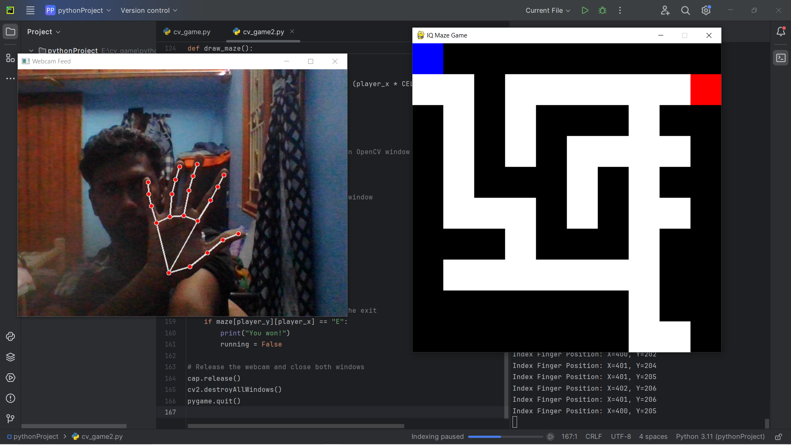

# handTracking_Maze_game

## Maze Game with Hand Gesture Controls

This project combines Pygame, OpenCV, and MediaPipe to create an interactive maze game where players navigate using hand gestures detected through their webcam. The game demonstrates how computer vision can be integrated into gaming for innovative and fun experiences.

---

## Features

- **Maze Game**: Navigate a player through a maze from the start (`S`) to the exit (`E`).
- **Hand Gesture Control**: Control player movement using the position of your index finger tracked by a webcam.
- **Interactive Gameplay**: Combines Pygame for graphical rendering and MediaPipe for hand-tracking.
- **Real-time Processing**: Uses OpenCV to process webcam feed and MediaPipe to detect hand landmarks.

---

## Setup Instructions

### Prerequisites

- Python 3.x
- Webcam for gesture tracking

### Required Libraries

Install the required libraries using pip:

```bash
pip install pygame opencv-python mediapipe
```
### Gameplay Demo



